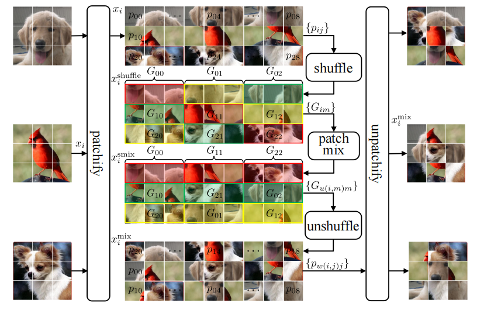
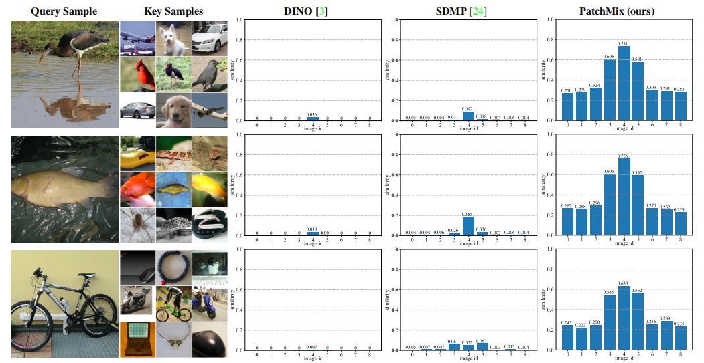

## Inter-Instance Similarity Modeling for Contrastive Learning

### 1. Introduction

This is a PyTorch implementation of [PatchMix](https://arxiv.org/) for self-supervised ViT.

### 2. Requirements

```
conda create -n patchmix python=3.8
pip install -r requirements.txt
```

<div align="center">
  
</div>

PatchMix is a novel image mix strategy, which mixes
multiple images in patch level. The mixed image contains
massive local components from multiple images and efficiently simulates rich similarities among natural images in
an unsupervised manner. To model rich inter-instance similarities among images, the contrasts between mixed images
and original ones, mixed images to mixed ones, and original
images to original ones are conducted to optimize the ViT
model. Experimental results demonstrate that our proposed
method significantly outperforms the previous state-of-the-art on both ImageNet-1K and CIFAR datasets, e.g., 2.1%
linear accuracy improvement on ImageNet-1K and 6.1%
kNN accuracy improvement on CIFAR100.

### 3. Datasets

Torchvision provides `CIFAR10`, `CIFAR100` datasets. The root paths of data are respectively set to `./dataset/cifar10`
and `./dataset/cifar100`. The code for experiments on `ImageNet-1K` dataset will be published soon.

### 4. Usage: Pretraining

#### ViT-Small with 1-node (8-GPU) training

set hyperparameter, dataset and GPUs in config/pretrain/vit_small_pretrain.py and run the following command

```bash
python main_pretrain.py --arch vit-small
```

### 5. Usage: KNN

set hyperparameter, dataset and GPUs in config/knn/knn.py and run the following command

```bash
python main_knn.py --arch vit-small --pretrained-weights /path/to/pretrained-weights.pth
```

### 6. Usage: Linear Classification

set hyperparameter, dataset and GPUs in config/linear/vit_small_linear.py and run the following command:

```bash
python main_linear.py --arch vit-small --pretrained-weights /path/to/pretrained-weights.pth
```

### 7. Usage: End-to-End Fine-tuning

set hyperparameter, dataset and GPUs in config/finetuning/vit_small_finetuning.py and run the following command

```bash
python python main_finetune.py --arch vit-small --pretrained-weights /path/to/pretrained-weights.pth
```

### 8. Main Results and Pretrained Model Weights

#### 8.1 ImageNet1K

|     arch     | params | k-nn  | linear | finetune | download                                                               |
|:------------:|:------:|:-----:|:------:|:--------:|------------------------------------------------------------------------|
|   ViT-S/16   |  21M   | 74.3% |  77.9%  |   83.4%   | [download](/disk2/home/liudw/backup/PatchMix/ckpt/pretrain/imagenet1k) |
|   ViT-B/16   |  85M   | 76.5% |  79.3%  |   84.3%   | [download](/disk2/home/liudw/backup/PatchMix/ckpt/pretrain/imagenet1k) |

#### 8.2 CIFAR10

|   arch   | params  |  k-nn   | linear  | finetune | download                                                               |
|:--------:|:-------:|:-------:|:-------:|:--------:|------------------------------------------------------------------------|
| ViT-T/16 |   5M    |  92.9%  |  94.4%  |  97.5%   | [download](/disk2/home/liudw/backup/PatchMix/ckpt/pretrain/cifar10/vit-tiny-800-92.94/last.pth) |
| ViT-S/16 |   21M   |  94.6%  |  96.0%  |  98.1%   | [download](/disk2/home/liudw/backup/PatchMix/ckpt/pretrain/cifar10/vit-small-800-94.64/last.pth) |
| ViT-B/16 |   85M   |  95.8%  |  96.6%  |  98.3%   | [download](/disk2/home/liudw/backup/PatchMix/ckpt/pretrain/cifar10/vit-base-800-95.81/last.pth) |

#### 8.2 CIFAR100

|   arch   | params  |  k-nn  | linear  |  finetune  | download                                                               |
|:--------:|:-------:|:------:|:-------:|:----------:|------------------------------------------------------------------------|
| ViT-T/16 |   5M    | 68.8%  | 74.7%   |   84.9%    | [download](/disk2/home/liudw/backup/PatchMix/ckpt/pretrain/cifar100/vit-tiny-800-68.75/last.pth) |
| ViT-S/16 |   21M   | 72.8%  |  78.3%  |   85.6%    | [download](/disk2/home/liudw/backup/PatchMix/ckpt/pretrain/cifar100/vit-small-800-72.76/last.pth) |
| ViT-B/16 |   85M   | 73.4%  |  79.7%  |   86.0%    | [download](/disk2/home/liudw/backup/PatchMix/ckpt/pretrain/cifar100/vit-base-800-73.43/last.pth) |


### The visualization of inter-instance similarities

<div align="center">
  
</div>

The query sample and the image with id 4 in key
samples are from the same category. The images with id 3 and 5 come from category similar to query sample.

### License

This repository is released under the Apache 2.0 license as found in the LICENSE file.

### Citation

```
@Article{patchmix,
  author  = {},
  title   = {Inter-Instance Similarity Modeling for Contrastive Learning},
  journal = {},
  year    = {},
}
```


